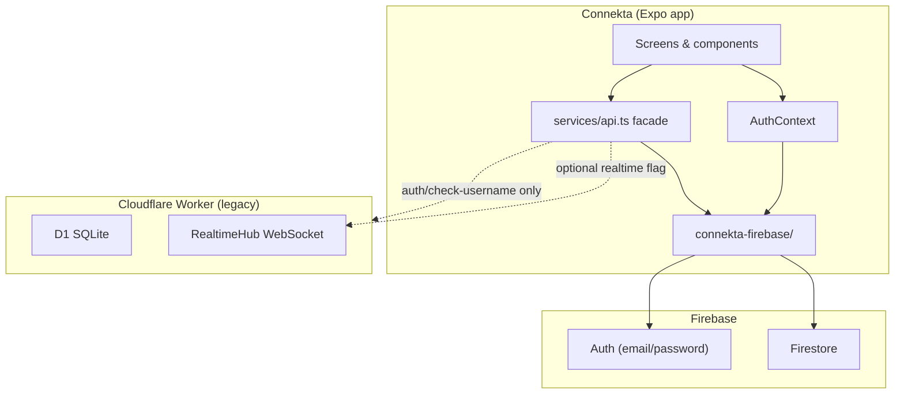

# Connekta — App Guide

Connekta is a **friends location-sharing app** built with **Expo (React Native)**. Users sign up with email, build a **circle** of friends, share live location on a **Mapbox map**, save **places**, and manage **emergency contacts** with an **SOS** flow.

This guide covers what is implemented, where code lives, and how Firebase is used.

---

## Architecture at a glance



**Current state:** Almost all app data (friends, location, places, emergency contacts) lives in **Firestore**. The Cloudflare Worker backend still exists for legacy routes and optional WebSocket realtime, but the mobile app reads/writes Firebase directly.

---

## Tech stack

| Layer | Technology |
|-------|------------|
| Mobile | Expo 54, React Native, Expo Router (file-based routing) |
| Maps | Mapbox (`@rnmapbox/maps`) — requires native build (not Expo Go) |
| Auth & data | Firebase Auth + Firestore |
| HTTP (legacy) | Axios → Cloudflare Worker (Hono + D1) |
| Security | Session timeout, biometric re-sign-in, Firestore security rules |
| Build | EAS Build — see [BUILD.md](./BUILD.md) |

---

## Project structure

```
Connekta/
├── app/                      # Screens (Expo Router)
│   ├── (landing)/            # Onboarding carousel
│   ├── auth/AuthScreen.tsx   # Sign up / sign in
│   ├── (tabs)/               # Main app (map, friends, safety, settings)
│   └── emergency/            # Modal emergency contact forms
├── connekta-firebase/        # Firebase SDK, Firestore services, rules
├── context/                  # AuthContext, ThemeContext
├── services/                 # api.ts facade, biometrics, session timeout
├── hooks/                    # Location polling, circle places
├── components/               # Map, UI (glass design), security guards
├── types/                    # Shared TypeScript types
├── utils/                    # Map helpers, invite links, username validation
├── constants/                # Theme, feature flags, layout
└── backend/ (repo root)      # Cloudflare Worker — legacy API + WebSocket hub
```

Import Firebase code as `@/connekta-firebase` (not `@/firebase` — that path collides with the npm package).

---

## App screens & features

### Landing (`app/(landing)/`)

Onboarding carousel introducing live map, friends, and secure sign-in. Routes to auth or main app.

### Auth (`app/auth/AuthScreen.tsx`)

- **Sign up:** email, password, username (validated + uniqueness check)
- **Sign in:** email + password
- **Biometric sign-in:** after enrolling, re-authenticate with Face ID / fingerprint after session timeout
- Uses `AuthContext` → `registerWithEmail` / `loginWithEmail` in Firebase

### Main tabs (`app/(tabs)/`)

Protected by `AuthGuard`, `SessionTimeoutGuard`, and optional `BiometricGate`.

| Tab / screen | Route | What it does |
|--------------|-------|--------------|
| **Map** | `map` | Mapbox map; your location; friend markers; circle places; sharing toggle; filter chips (all / friends / places) |
| **Friends** | `friends` | Circle list, incoming requests, mini-map preview, accept/decline/remove |
| **Safety** | `emergency` | Emergency contacts (add from device contacts or manually), share safety info |
| **Profile** | `settings/` | Account info, biometric toggle, links to sub-settings, logout |
| **My Places** | `MyPlaces` (menu) | Create/delete saved places with kind (home, office, gym, school, other) |
| **Share Location** | `ShareLocation` (menu) | Toggle location sharing on/off |
| **SOS** | `SOSScreen` (menu) | Hold-to-trigger SOS; texts emergency contacts with location link |
| **Circle Management** | `settings/CircleManagement` | Generate invite codes, join with code, remove members, share invite link |
| **Location History** | `settings/LocationHistory` | View your recent location pings |

### Navigation

- Custom tab bar: `components/navigation/ConnektaTabBar.tsx`
- Hamburger menu on Map opens hidden screens (My Places, Share Location, SOS)

---

## Firebase usage

### Configuration (`connekta-firebase/config.ts`)

Firebase is initialized from environment variables:

- `EXPO_PUBLIC_FIREBASE_API_KEY`
- `EXPO_PUBLIC_FIREBASE_AUTH_DOMAIN`
- `EXPO_PUBLIC_FIREBASE_PROJECT_ID`
- `EXPO_PUBLIC_FIREBASE_STORAGE_BUCKET`
- `EXPO_PUBLIC_FIREBASE_MESSAGING_SENDER_ID`
- `EXPO_PUBLIC_FIREBASE_APP_ID`

Auth uses React Native persistence (`AsyncStorage`). Exports: `auth`, `firestore`, `db`.

### Firestore collections

| Collection | Document ID | Purpose |
|------------|-------------|---------|
| `users` | Firebase UID | Profile: email, username, deviceId, `sharing`, `lat`, `lng`, `locationUpdatedAt` |
| `usernames` | lowercase username | Username → UID lookup (unique constraint) |
| `friendRequests` | auto | Pending/accepted/rejected friend requests (`fromUid`, `toUid`, `status`) |
| `friendships` | `{uidA}_{uidB}` (sorted) | Circle membership (`memberIds: [uid1, uid2]`) |
| `places` | auto | Saved places (`userId`, `name`, `kind`, `lat`, `lng`) |
| `emergencyContacts` | auto | SOS contacts (`userId`, `name`, `phone`, `sortOrder`) |
| `circleInvites` | 8-char code | Invite codes (`ownerUid`, `expiresAt`, `createdAt`) |

### Security rules (`connekta-firebase/rules/firestore.rules`)

- **users:** any signed-in user can read; only owner can write their doc
- **usernames:** public read (for sign-up check); create only for own UID
- **friendRequests / friendships:** participants only
- **places:** owner + friends can read; only owner can create/update/delete
- **emergencyContacts:** owner only
- **circleInvites:** signed-in users can read; owner manages their invites

Publish rules in Firebase Console → Firestore → Rules (paste from `rules/firestore.rules`).

---

## Key modules & functions

### Auth (`connekta-firebase/auth-service.ts`)

| Function | Description |
|----------|-------------|
| `registerWithEmail(email, password, username, deviceId)` | Creates Auth user + `users/{uid}` + `usernames/{key}` atomically |
| `loginWithEmail(email, password)` | Signs in and loads profile |
| `loadAppUser(fbUser)` | Reads `users/{uid}` → `AppUser` |
| `isUsernameAvailable(username)` | Checks `usernames` collection |
| `verifyCurrentUserPassword(password)` | Re-auth before saving biometrics |
| `subscribeToAuthState(callback)` | `onAuthStateChanged` wrapper |
| `firebaseLogout()` | Signs out |
| `firebaseAuthErrorMessage(err)` | User-friendly error strings |

### Circle & friends (`connekta-firebase/firestore/circle.ts`)

| Function | Description |
|----------|-------------|
| `searchUsers(uid, query)` | Prefix search on `usernames` |
| `listFriends(uid)` | All circle members |
| `listIncoming(uid)` | Pending friend requests |
| `sendFriendRequest(from, to)` | Creates request; auto-accepts if reciprocal |
| `acceptFriendRequest(current, from)` | Accepts + creates friendship doc |
| `rejectFriendRequest(current, from)` | Marks rejected |
| `removeFriend(current, friend)` | Deletes friendship + request |
| `generateInvite(uid)` | Creates 8-char code (30-day TTL) |
| `getInvite(uid)` | Returns active invite for owner |
| `joinWithInviteCode(uid, code)` | Sends friend request to invite owner |

### Location (`connekta-firebase/firestore/location.ts`)

| Function | Description |
|----------|-------------|
| `setLocationSharing(uid, enabled)` | Toggles `users.sharing` |
| `pingLocation(uid, lat, lng)` | Updates coordinates + timestamp |
| `getMyLocationState(uid)` | Returns sharing flag + last position |
| `listFriendLocations(uid)` | Friends in circle who are sharing |

Map tab pings every **20s** (min) and only when moved **50m+**. Friend locations poll every **60s** while the map tab is focused.

### Places (`connekta-firebase/firestore/places.ts`)

| Function | Description |
|----------|-------------|
| `listMyPlaces(uid)` | User's own places |
| `listCirclePlaces(uid)` | Own + all friends' places |
| `createPlace(uid, username, name, lat, lng, kind?)` | Adds a place |
| `deletePlace(placeId, uid)` | Removes a place |

### Emergency (`connekta-firebase/firestore/emergency.ts`)

| Function | Description |
|----------|-------------|
| `listEmergencyContacts(uid)` | All contacts for user |
| `addEmergencyContact(uid, name, phone)` | Adds contact |
| `removeEmergencyContact(uid, contactId)` | Deletes contact |

### Friends helper (`connekta-firebase/firestore/friends.ts`)

| Function | Description |
|----------|-------------|
| `ensureFirestoreSignedIn(uid)` | Verifies Auth session + cached ID token (avoids quota burn) |
| `getCircleMemberUids(uid)` | Self + all friend UIDs |
| `isAuthQuotaExceeded(err)` | Detects Firebase Auth quota errors |

### API facade (`services/api.ts`)

Screens call these objects — they wrap Firestore, not HTTP (except legacy auth username check):

| Export | Methods |
|--------|---------|
| `authAPI` | `checkUsername`, `register`, `login` (legacy Worker; sign-up uses Firebase directly) |
| `friendsAPI` | `search`, `sendRequest`, `accept`, `reject`, `list`, `remove`, `incoming`, `getInvite`, `generateInvite`, `joinWithCode` |
| `placesAPI` | `mine`, `circle`, `create`, `remove` |
| `locationAPI` | `setSharing`, `ping`, `friendsLocations`, `myState` |
| `emergencyAPI` | `list`, `add`, `remove` |
| `getRealtimeWebSocketUrl(token)` | WebSocket URL for optional live updates |

Also exports `getApiErrorMessage`, `setApiAuthToken`, and the Axios `apiClient`.

### React context (`context/AuthContext.tsx`)

| Hook / method | Description |
|---------------|-------------|
| `useAuth()` | Access `user`, `token`, `isLoggedIn`, `isLoading`, `error` |
| `register(email, password, username)` | Sign up flow |
| `login(email, password)` | Sign in flow |
| `logout()` | Full sign-out + clears biometrics |
| `expireSession()` | Sign-out after timeout; keeps biometric creds |
| `clearError()` | Clears auth error state |

Syncs Firebase ID token to `services/api.ts` for any legacy HTTP calls.

### Hooks

| Hook | File | Purpose |
|------|------|---------|
| `useLiveFriendLocations(active, uid)` | `hooks/useLiveFriendLocations.ts` | Polls friend locations every 60s on Map tab |
| `useFriendLocationsPoll(active, uid)` | `hooks/useFriendLocationsPoll.ts` | Same pattern for Friends tab preview map |
| `useCirclePlaces(active, uid)` | `hooks/useCirclePlaces.ts` | Loads circle places (20s debounce) |
| `useMarkerTracks()` | `hooks/useMarkerTracks.ts` | Map marker animation helpers |

### Security services

| Module | Purpose |
|--------|---------|
| `services/session-activity.ts` | 10-minute inactivity timeout (`SESSION_TIMEOUT_MS`) |
| `services/biometric-unlock.ts` | Face ID / fingerprint enrollment + credential storage in SecureStore |
| `components/security/SessionTimeoutGuard.tsx` | Expires session on background / no touch |
| `components/security/BiometricGate.tsx` | One-time post-login biometric enrollment prompt |
| `components/auth/AuthGuard.tsx` | Redirects unauthenticated users to auth screen |

---

## Map system

- **Primary engine:** Mapbox via `components/map/ConnektaMap.tsx`
- **Markers:** friend pills, place labels, place area circles, draft pins
- **Config:** `EXPO_PUBLIC_MAPBOX_TOKEN` (public `pk.*` token)
- **Build tokens:** `MAPBOX_DOWNLOADS_TOKEN`, `RNMAPBOX_MAPS_DOWNLOAD_TOKEN` (EAS secrets)
- **Limits:** `utils/map-limits.ts` caps markers for performance
- **Feature flags:** `constants/features.ts`
  - `ENABLE_REALTIME` — WebSocket live updates (off by default)
  - `ENABLE_FRIEND_LOCATION_POLL` — REST/Firestore polling (on)
  - `ENABLE_MAP_LOCATION_TRACKING` — GPS watch on Map tab (on unless disabled)

---

## Types reference

| Type | File | Fields |
|------|------|--------|
| `AppUser` | `types/user.ts` | `uid`, `email`, `username` |
| `FriendUser` | `types/friends.ts` | `id`, `username` |
| `FriendLocation` | `types/location.ts` | `id`, `username`, `lat`, `lng`, `updated_at` |
| `SavedPlace` | `types/places.ts` | `id`, `userId`, `username`, `name`, `kind?`, `lat`, `lng`, `created_at` |
| `EmergencyContact` | `types/emergency.ts` | `id`, `name`, `phone`, `sort_order` |
| `PlaceKind` | `types/places.ts` | `'home' \| 'office' \| 'gym' \| 'school' \| 'other'` |

---

## Environment variables

Create `Connekta/.env` (see `.env` locally; push to EAS with `npm run env:push-eas`):

| Variable | Required | Purpose |
|----------|----------|---------|
| `EXPO_PUBLIC_FIREBASE_*` (6 vars) | Yes | Firebase project config |
| `EXPO_PUBLIC_MAPBOX_TOKEN` | Yes | Map rendering |
| `MAPBOX_DOWNLOADS_TOKEN` | EAS build | Mapbox SDK download |
| `RNMAPBOX_MAPS_DOWNLOAD_TOKEN` | EAS build | Same (alternate name) |
| `EXPO_PUBLIC_API_URL` | Optional | Legacy Worker base URL |
| `EXPO_PUBLIC_WS_URL` | Optional | Override WebSocket URL |
| `EXPO_PUBLIC_ENABLE_REALTIME` | Optional | `true` to enable WebSocket updates |
| `EXPO_PUBLIC_ENABLE_MAP_TRACKING` | Optional | Set `false` to disable GPS on map |

---

## Cloudflare backend (legacy)

Located at `backend/` in the repo root.

| Route prefix | Status | Notes |
|--------------|--------|-------|
| `/auth/*` | Partially used | Username check may hit Worker; auth is Firebase |
| `/friends/*` | Deprecated | App uses Firestore |
| `/location/*` | Deprecated | App uses Firestore |
| `/places/*` | Deprecated | App uses Firestore |
| `/emergency/*` | Deprecated | App uses Firestore |
| `/realtime/ws` | Optional | Durable Object hub; gated by `ENABLE_REALTIME` |

Stack: Hono, D1 SQLite, JWT middleware, Resend email, Durable Object `RealtimeHub`.

Local dev: `cd backend && npx wrangler dev`

---

## Data flow examples

### Sign up

1. User fills form on `AuthScreen`
2. `AuthContext.register` → `registerWithEmail`
3. Firebase Auth creates user
4. Firestore batch writes `usernames/{key}` + `users/{uid}`
5. ID token synced; optional biometric enrollment scheduled

### Share location on map

1. User enables sharing on Map tab
2. `locationAPI.setSharing(true)` → updates `users.sharing`
3. GPS watch fires → `locationAPI.ping(lat, lng)` every ~20s when moved 50m+
4. Friends poll `listFriendLocations` → read friends' `users` docs where `sharing == true`

### Join circle via invite

1. Owner generates code in Circle Management → `circleInvites/{CODE}`
2. Friend enters code → `joinWithInviteCode` → `sendFriendRequest`
3. Owner accepts on Friends tab → `friendships/{uidA_uidB}` created
4. Both can now see each other's shared locations and places

---

## Quick start

```bash
cd Connekta
npm install
# Copy .env with Firebase + Mapbox keys
npx expo start          # Dev (map needs dev build, not Expo Go)
npm run build:android:apk # Device install — see BUILD.md
```

---

## Related docs

- [BUILD.md](./BUILD.md) — EAS builds, APK/IPA, env secrets
- [connekta-firebase/README.md](./connekta-firebase/README.md) — Firebase folder layout
- [backend/AGENTS.md](../backend/AGENTS.md) — Cloudflare Worker commands
